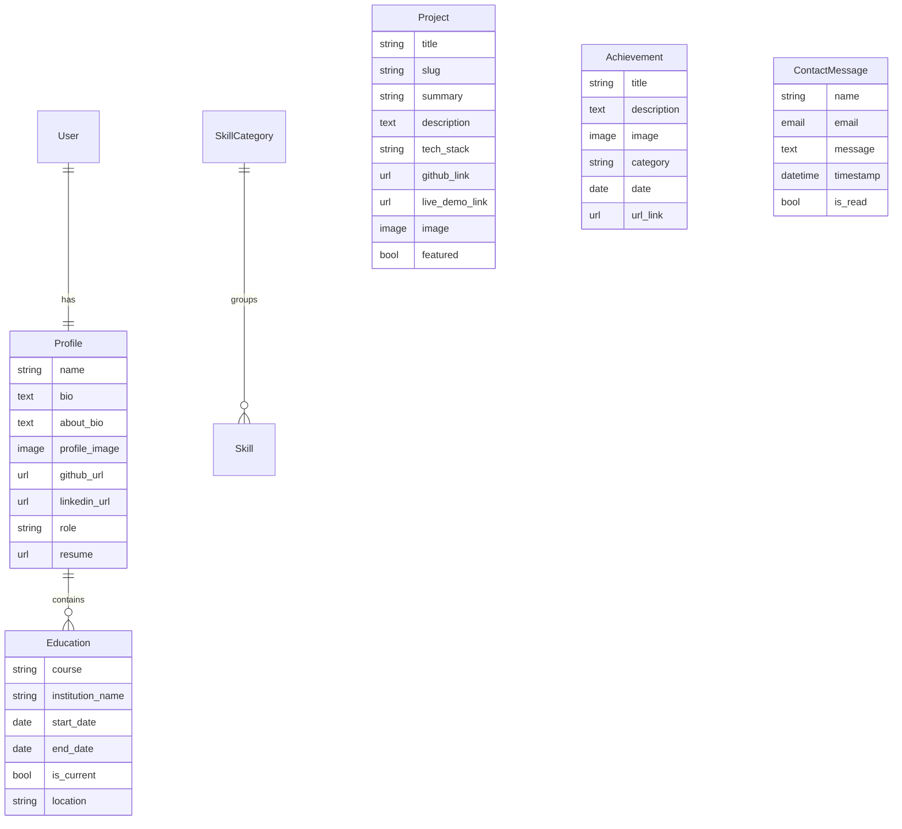

<div align="center">

# 🚀 Portfolio — Full-Stack Django Application

**A production-ready, full-stack portfolio platform built with Django, PostgreSQL, and Django REST Framework.**\
Designed with a modular architecture, REST API layer, cloud media storage, and a polished dark/light mode UI.

### 🌐 [**View Live Portfolio →**](https://my-portfolio-a6jj.onrender.com/)

[](https://www.python.org/)
[](https://www.djangoproject.com/)
[](https://neon.tech/)
[](https://www.django-rest-framework.org/)
[](https://my-portfolio-a6jj.onrender.com/)
[]()

</div>

---

## 📋 Table of Contents

- [Overview](#-overview)
- [Key Features](#-key-features)
- [Tech Stack](#-tech-stack)
- [Architecture](#-architecture)
- [Project Structure](#-project-structure)
- [Database Schema](#-database-schema)
- [REST API Reference](#-rest-api-reference)
- [Getting Started](#-getting-started)
- [Environment Variables](#-environment-variables)
- [Deployment (Render)](#-deployment-render)
- [License](#-license)

---

## 🎯 Overview

This is not a static HTML portfolio — it's a **dynamic, database-driven web application** where all content (projects, skills, achievements, education, and profile) is managed through Django's admin panel. It features a complete authentication system, a REST API for programmatic access, email integration for the contact form, and cloud-based media storage via Cloudinary.

---

## ✨ Key Features

| Category | Features |
|---|---|
| **🔐 Authentication** | User signup, login, logout with session management. Token-based API auth via DRF. |
| **📊 Dashboard** | Protected admin dashboard for managing all portfolio content. |
| **💼 Projects** | Full CRUD with auto-generated slugs, tech stack parsing, featured sorting, and image uploads. |
| **🛠️ Skills** | Hierarchical skill management with categories (e.g., *Languages*, *ML*, *Databases*) and custom ordering. |
| **🏆 Achievements** | Certifications, hackathons, awards — categorized with dates and verification links. |
| **🎓 Education** | Education timeline with support for current/completed status and institution details. |
| **📬 Contact** | Contact form that saves messages to DB and sends dual emails (admin notification + user confirmation). |
| **🌓 Dark/Light Mode** | Toggle between dark and light themes with a polished, responsive UI. |
| **📡 REST API** | Public project listing, authenticated project creation, contact submission — all via JSON endpoints. |
| **☁️ Cloud Media** | Cloudinary integration for persistent image storage in production. |
| **⚡ Health Check** | Built-in `/health/` endpoint for uptime monitoring. |

---

## 🧰 Tech Stack

<table>
<tr>
<td><b>Backend</b></td>
<td>Python 3.10+ · Django 4.2 · Django REST Framework 3.17 · Gunicorn</td>
</tr>
<tr>
<td><b>Database</b></td>
<td>Neon (Serverless PostgreSQL) · dj-database-url</td>
</tr>
<tr>
<td><b>Frontend</b></td>
<td>HTML5 · CSS3 · JavaScript · Django Templates</td>
</tr>
<tr>
<td><b>Auth</b></td>
<td>Session Authentication · DRF Token Authentication · SimpleJWT</td>
</tr>
<tr>
<td><b>Media Storage</b></td>
<td>Cloudinary · django-cloudinary-storage</td>
</tr>
<tr>
<td><b>Static Files</b></td>
<td>WhiteNoise (compressed + manifest)</td>
</tr>
<tr>
<td><b>Email</b></td>
<td>SMTP (Gmail) · Django Email Backend</td>
</tr>
<tr>
<td><b>Deployment</b></td>
<td>Render · build.sh auto-deploy pipeline</td>
</tr>
<tr>
<td><b>Dev Tools</b></td>
<td>Flake8 · python-dotenv · django-cors-headers</td>
</tr>
</table>

---

## 🏗️ Architecture

```
┌──────────────────────────────────────────────────────────────┐
│                        CLIENT BROWSER                        │
│                   (HTML/CSS/JS — Dark/Light)                 │
└────────────────┬──────────────────────┬──────────────────────┘
                 │  Django Templates    │  REST API (JSON)
                 ▼                      ▼
┌──────────────────────────────────────────────────────────────┐
│                     DJANGO APPLICATION                       │
│  ┌────────────┐ ┌────────────┐ ┌────────────┐ ┌───────────┐ │
│  │ accounts   │ │ projects   │ │  skills    │ │achievements│ │
│  │   _app     │ │   _app     │ │   _app     │ │   _app    │ │
│  └────────────┘ └────────────┘ └────────────┘ └───────────┘ │
│  ┌────────────┐ ┌────────────┐                               │
│  │ contact    │ │  api_app   │  Context Processors           │
│  │   _app     │ │  (DRF)     │  Middleware Stack             │
│  └────────────┘ └────────────┘                               │
└────────────────┬──────────────────────┬──────────────────────┘
                 │                      │
        ┌────────▼────────┐    ┌────────▼────────┐
        │  Neon Postgres  │    │   Cloudinary    │
        │  (Serverless)   │    │ (Media Storage) │
        └─────────────────┘    └─────────────────┘
```

---

## 📁 Project Structure

```
PortfolioProject/
├── .env.example                  # Environment variable template
├── .gitignore
├── build.sh                      # Render build & deploy script
├── requirements.txt              # Top-level dependency pins
│
└── portfolio_site/               # Django project root (manage.py)
    ├── manage.py
    ├── requirements.txt          # Locked dependency versions
    │
    ├── portfolio_site/           # Django settings module
    │   ├── settings.py           # Production-ready configuration
    │   ├── urls.py               # Root URL routing
    │   ├── wsgi.py               # WSGI entry point (Gunicorn)
    │   └── context_processors.py # Global profile injection
    │
    ├── accounts_app/             # Profile, Education, Auth views
    ├── projects_app/             # Project model & CRUD views
    ├── skills_app/               # SkillCategory + Skill models
    ├── achievements_app/         # Certifications & awards
    ├── contact_app/              # Contact form + email dispatch
    ├── api_app/                  # REST API (DRF views & serializers)
    │
    ├── templates/                # Django HTML templates
    │   ├── base.html             # Master layout (nav, footer, theme)
    │   ├── home.html             # Landing page with hero section
    │   ├── about.html            # Extended bio & education timeline
    │   ├── projects.html         # Project cards grid
    │   ├── contact.html          # Contact form
    │   └── dashboard.html        # Protected admin dashboard
    │
    ├── static/                   # CSS, JS, images
    └── media/                    # User-uploaded files (dev only)
```

---

## 🗃️ Database Schema



---

## 📡 REST API Reference

Base URL: `/api/`

### Endpoints

| Method | Endpoint | Auth | Description |
|--------|----------|------|-------------|
| `GET` | `/api/projects/` | ❌ Public | List all portfolio projects |
| `POST` | `/api/projects/` | 🔒 Token | Create a new project |
| `POST` | `/api/contact/` | ❌ Public | Submit a contact message |
| `POST` | `/api/auth/token/` | 🔑 Credentials | Obtain auth token |

### Authentication

```bash
# 1. Obtain your token
curl -X POST https://your-domain.com/api/auth/token/ \
  -d "username=your_username&password=your_password"

# Response: { "token": "abc123..." }

# 2. Use the token in subsequent requests
curl -X POST https://your-domain.com/api/projects/ \
  -H "Authorization: Token abc123..." \
  -H "Content-Type: application/json" \
  -d '{"title": "My Project", "summary": "...", "description": "...", "tech_stack": "Python, Django", "github_link": "https://github.com/..."}'
```

### Sample Response — `GET /api/projects/`

```json
[
  {
    "id": 1,
    "title": "Stock Market Prediction & Analytics App",
    "slug": "stock-market-prediction-analytics-app",
    "summary": "Machine Learning based Stock Market Prediction and Decision Support System",
    "tech_stack": "Supervised Learning, NumPy, Pandas, Matplotlib, Streamlit",
    "github_link": "https://github.com/anvesh9621/stock-market-prediction-app",
    "featured": false
  }
]
```

---

## 🚀 Getting Started

### Prerequisites

- Python 3.10+
- PostgreSQL 14+ (or a [Neon](https://neon.tech/) serverless database)
- Git

### Installation

```bash
# 1. Clone the repository
git clone https://github.com/anvesh9621/Portfolio.git
cd Portfolio

# 2. Create and activate a virtual environment
python -m venv venv
source venv/bin/activate        # Linux/macOS
venv\Scripts\activate           # Windows

# 3. Install dependencies
pip install -r portfolio_site/requirements.txt

# 4. Set up environment variables
cp .env.example .env
# Edit .env with your Neon/PostgreSQL credentials and other settings

# 5. Navigate to the Django project
cd portfolio_site

# 6. Apply database migrations
python manage.py migrate

# 7. Create a superuser (for admin access)
python manage.py createsuperuser

# 8. Collect static files
python manage.py collectstatic --no-input

# 9. Start the development server
python manage.py runserver
```

Open [http://127.0.0.1:8000](http://127.0.0.1:8000) in your browser.\
Admin panel is available at [http://127.0.0.1:8000/admin/](http://127.0.0.1:8000/admin/).

---

## 🔐 Environment Variables

Create a `.env` file in the project root. See [`.env.example`](.env.example) for the full template.

| Variable | Required | Description |
|----------|----------|-------------|
| `SECRET_KEY` | ✅ | Django secret key for cryptographic signing |
| `DEBUG` | ✅ | Set to `False` in production |
| `ALLOWED_HOSTS` | ✅ | Comma-separated list of allowed hostnames |
| `DATABASE_URL` | ⚡ | Neon PostgreSQL connection string (production) |
| `DB_NAME` | 🔄 | Database name (local fallback) |
| `DB_USER` | 🔄 | Database user (local fallback) |
| `DB_PASSWORD` | 🔄 | Database password (local fallback) |
| `DB_HOST` | 🔄 | Database host (local fallback) |
| `DB_PORT` | 🔄 | Database port (local fallback) |
| `CLOUDINARY_URL` | ☁️ | Cloudinary connection string for media uploads |
| `EMAIL_BACKEND` | 📧 | Django email backend class |
| `EMAIL_HOST_USER` | 📧 | SMTP email address |
| `EMAIL_HOST_PASSWORD` | 📧 | SMTP app password |
| `ADMIN_EMAIL` | 📧 | Email to receive contact form notifications |

> ⚡ = Used in production (Render) &nbsp; 🔄 = Local dev fallback &nbsp; ☁️ = Optional &nbsp; 📧 = For email features

---

## ☁️ Deployment (Render)

This project is configured for one-click deployment on [Render](https://render.com/).

### How It Works

1. **Web Service**: Render runs `gunicorn portfolio_site.wsgi:application` to serve the app.
2. **Build Script**: [`build.sh`](build.sh) automates the build pipeline:
   ```bash
   pip install -r portfolio_site/requirements.txt
   cd portfolio_site
   python manage.py collectstatic --no-input
   python manage.py migrate
   ```
3. **Database**: Uses `DATABASE_URL` env var (Neon serverless PostgreSQL) → parsed by `dj-database-url`.
4. **Static Files**: Served by WhiteNoise middleware (no Nginx required).
5. **Media Files**: Stored on Cloudinary (Render has an ephemeral filesystem).
6. **Allowed Hosts**: Auto-configured via `RENDER_EXTERNAL_HOSTNAME`.
7. **Health Check**: `/health/` endpoint returns `200 OK` for Render's uptime monitoring.

### Render Environment Variables to Set

| Variable | Value |
|----------|-------|
| `SECRET_KEY` | A strong random key |
| `DEBUG` | `False` |
| `DATABASE_URL` | Your Neon PostgreSQL connection string |
| `CLOUDINARY_URL` | Your Cloudinary URL |
| `EMAIL_HOST_USER` | Your Gmail address |
| `EMAIL_HOST_PASSWORD` | Your Gmail App Password |
| `ADMIN_EMAIL` | Your notification email |

---

## 📄 License

This is a personal portfolio project. All rights reserved.

---

<div align="center">

**Built with ❤️ by [Anvesh Pandey](https://github.com/anvesh9621)**

</div>
